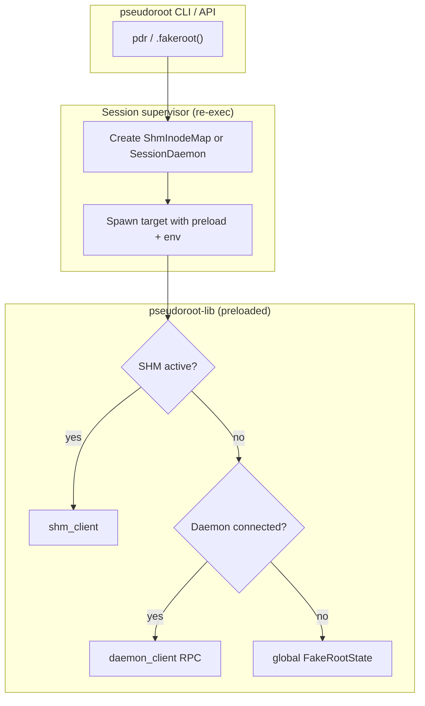

# Architecture

## Overview

pseudoroot fakes root privileges for unprivileged processes by interposing libc
syscalls via a preloaded shared library. The library records fake uid/gid,
file modes, device metadata, and extended attributes in an in-memory inode
table keyed by `(st_dev, st_ino)`; `stat` and friends overlay those values on
top of the real filesystem. Nothing is written to disk for ownership — the
real uid/gid on files stays unchanged.

Three cooperating layers:

1. **`pseudoroot` CLI / API** — sets up the environment (`LD_PRELOAD` /
   `DYLD_INSERT_LIBRARIES`, uid/gid env vars, session or daemon backing) and
   spawns the target command.
2. **`pseudoroot-lib` cdylib** — hooks libc symbols at load time and routes
   every fake-metadata operation through the active state backend.
3. **`pseudoroot-core`** — shared state types, the daemon IPC protocol, and
   the shared-memory session map both the CLI and the cdylib depend on.

## Crates

| Crate | Purpose | Key entry points |
|-------|---------|------------------|
| `pseudoroot-core` | Shared types, inode-keyed state, daemon IPC, SHM session map | `FakeRootState`, `protocol::IpcChannel`, `shm_map::ShmInodeMap` |
| `pseudoroot-lib` | Interposed cdylib (`LD_PRELOAD` / `DYLD_INSERT_LIBRARIES`) | Built from `pseudoroot/interpose/`; not published |
| `pseudoroot-daemon` | Optional standalone daemon binary (`pdrd`) | `daemon_server::run_blocking` |
| `pseudoroot` | CLI (`pdr`) and Rust API crate | `FakerootCommandExt`, `init`, `library_path` |
| `pseudoroot-tests` | Integration, CLI, and interposition tests | — |

The interposition source lives inside the `pseudoroot` package at
`pseudoroot/interpose/`. `pseudoroot/build.rs` compiles it into a throwaway
cdylib and embeds the artifact with `include_bytes!`, so `cargo install
pseudoroot` is self-contained. `pseudoroot-lib` is a dev/CI shim that builds
the same source so the test harness can scan `target/{debug,release}` for the
`.so`/`.dylib`.

## State backends

Fake metadata must survive `exec` within a build (`make install` → `tar`) but
need not persist across unrelated shell invocations unless you opt in. The
interposed library picks a backend at first use:

| Mode | Trigger | Backing store | Scope |
|------|---------|---------------|-------|
| **Session SHM** (default) | Normal `pdr` / `.fakeroot()` | `mmap` of anonymous shared memory (`memfd` on Linux, `shm_open` on macOS) | One invocation tree; fd inherited across `exec` |
| **Session socket** | `PSEUDOROOT_SESSION_SHM=0` | In-process `SessionDaemon` + Unix socket | Same scope as SHM session |
| **External daemon** | `--daemon` / `PSEUDOROOT_DAEMON_SOCKET` | `pdrd` or `pdr start` over Unix socket | Separate top-level invocations |
| **Standalone** | `PSEUDOROOT_STANDALONE=1` | Per-process `FakeRootState` (`RwLock`) | Single process; inherited across `fork()` |

Priority inside the cdylib (see `ownership.rs`):

1. Shared-memory map when `PSEUDOROOT_SHM_FD` is set and maps successfully.
2. Daemon RPC when `PSEUDOROOT_DAEMON_SOCKET` is set and connected.
3. In-process global state otherwise.



### Session lifecycle (default)

When neither `PSEUDOROOT_DAEMON_SOCKET` nor `PSEUDOROOT_STANDALONE` is set,
`.fakeroot()` re-executes the current binary with `__PSEUDOROOT_SUPERVISE=1`.
`pseudoroot::init()` (also wired via `#[ctor]`) detects the marker and becomes
the supervisor:

1. Create a `ShmInodeMap` (or start a `SessionDaemon` if SHM is disabled).
2. Clear `CLOEXEC` on the shm fd and pass `PSEUDOROOT_SHM_FD` +
   `PSEUDOROOT_SHM_LEN` to the child (or pass the daemon socket path).
3. Set `LD_PRELOAD` / `DYLD_INSERT_LIBRARIES` to the embedded library.
4. `exec` the user's command; tear down when it exits.

The supervisor never preloads itself — only the child and its descendants
carry the interposed library.

## State model

Fake metadata is keyed by `(dev, ino)` inode identity — not paths — so
renames, hard links, and concurrent writers stay consistent.

| Field | Set by | Returned by |
|-------|--------|-------------|
| `uid`, `gid` | `chown*` | `stat*`, `getuid`, … |
| `mode` | `chmod*`, `mknod*` | `stat*` (permission + type bits) |
| `rdev` | `mknod*` | `stat*` for device nodes |
| `xattrs` | `setxattr`, fake `capset` | `getxattr`, `listxattr` |

`chown` records fake uid/gid in the inode table; `stat`/`statx` overlay the
result. `chmod` records the fake mode and calls the real syscall with
permission bits zeroed so unprivileged processes do not get `EPERM`. `unlink` /
`rename` drop stale inode entries so recycled inode numbers do not inherit
ghost metadata.

`FakeInode::ID_UNCHANGED` (`u32::MAX`) is the sentinel for partial `chown`
updates (leave one id unchanged).

## IPC protocol

Daemon communication uses length-prefixed bincode frames over a Unix domain
socket (`protocol::write_framed` / `read_framed`). Payload types live in
`pseudoroot-core/src/protocol.rs`.

| `MessageType` | Direction | Purpose |
|---------------|-----------|---------|
| `Init` | lib → daemon | Set initial uid/gid on connect |
| `GetCurrentUidGid` / `SetCurrentUidGid` | lib ↔ daemon | Credential queries |
| `RegisterOwnership` | lib → daemon | Full inode replace (`set_inode`) |
| `UpsertChown` | lib → daemon | Merge uid/gid (`upsert_chown`) |
| `GetOwnership` / `RemoveOwnership` | lib ↔ daemon | Lookup / delete by inode key |
| `Ping` | either | Health check |
| `Shutdown` | CLI → daemon | Graceful stop (`pdr stop`) |

Default socket path: `/tmp/pseudoroot.sock` (`DEFAULT_SOCKET_PATH`). The
listener sets mode `0666` so clients running as arbitrary users can connect.

## Shared-memory map layout

`ShmInodeMap` (`shm_map.rs`) is a fixed-size open-addressed hash table in
shared anonymous memory:

```
[ Header | Slot[slot_count] | XattrPage[slot_count] ]
```

- **Header** — magic (`PDRS`), version, `slot_count`, atomic current uid/gid.
- **Slot** — `(dev, ino, uid, gid, mode, rdev)` plus occupancy state
  (`empty` / `live` / `tombstone`).
- **XattrPage** — 4 KiB bincode-serialized xattr map per slot; overflow is
  dropped with a warning.

The session supervisor creates the map, clears `FD_CLOEXEC` on the fd, and
passes `PSEUDOROOT_SHM_FD` + `PSEUDOROOT_SHM_LEN` to children. The cdylib
duplicates the inherited fd (so the supervisor keeps its copy) and `mmap`s it.

Set `PSEUDOROOT_SESSION_SHM=0` to fall back to per-session socket IPC
instead (useful for debugging or platforms where shm inheritance misbehaves).

## Platform support

Linux and macOS are both fully supported, with the same shared-memory session
mode by default (backed by `memfd_create` on Linux and `shm_open` on macOS).
Linux interposes via `LD_PRELOAD` and `#[no_mangle]` exports; macOS via
`DYLD_INSERT_LIBRARIES` and a `__DATA,__interpose` table in
`platform/macos.rs`. Every syscall family below is faked on both, except a
few with no Darwin equivalent (`statx`, `renameat2`, `capset`) which stay
Linux-only.

**Linux specifics**

- `stat`/`fstat`/… call raw syscalls to avoid `dlsym(RTLD_NEXT)` resolving
  back into our own hooks.
- Other libc functions use lazy `dlsym(RTLD_NEXT)` after library init
  completes (see `platform/linux.rs` `real_fn!` macro).
- Separate `l*xattr` entry points; `stat64` aliases on 64-bit glibc.

**macOS specifics**

- `real_*` wrappers call libc directly (dyld does not interpose the
  interposing image against itself).
- xattr hooks use Darwin's `position`/`options` ABI; `XATTR_NOFOLLOW`
  replaces Linux's `l*` variants.
- No `/proc/self/fd` — relative `*at` path resolution is limited.

macOS System Integrity Protection strips `DYLD_INSERT_LIBRARIES` from
Apple-signed binaries (`/bin/sh`, `/usr/bin/id`, system coreutils, …), so
those cannot be faked. Interposition applies to binaries you build or install
yourself, including Homebrew's unsigned GNU tools (`ginstall`, `gtar`, …).

CI runs the full test suite and clippy on both `ubuntu-latest` and
`macos-latest`.

## Interposed syscall families

- **Credentials** — `getuid`, `setuid`, `setresuid`, `setfsuid`, `setgroups`, … (Linux + macOS); `capset` (Linux only)
- **Stat** — `stat`, `lstat`, `fstat`, `fstatat` (Linux + macOS; uid/gid/mode/rdev overlay); `statx` (Linux only)
- **Ownership** — `chown`, `lchown`, `fchown`, `fchownat` (Linux + macOS)
- **Mode** — `chmod`, `fchmod`, `fchmodat` (Linux + macOS; record fake mode, real syscall with EPERM zeroed)
- **Inode lifecycle** — `unlink`, `rmdir`, `rename`, `unlinkat`, `renameat` (Linux + macOS; drop stale inode entries); `renameat2` (Linux only)
- **Creation** — `mknod`, `mknodat` (Linux + macOS; placeholder file + faked device metadata)
- **xattr** — the `*xattr` family (Linux + macOS; fake `security.capability`, ACLs, etc.)

## Module map

### `pseudoroot-core`

| Module | Role |
|--------|------|
| `state` | `FakeInode`, `FakeRootState`, per-process global state |
| `protocol` | IPC message types, framing, `IpcChannel` |
| `daemon_server` | `SessionDaemon`, `run_blocking` (used by `pdrd` and `pdr start`) |
| `daemon_client` | Lazy Unix-socket RPC from the cdylib |
| `shm_map` | Create/map the session hash table |
| `shm_client` | cdylib-side accessors for the inherited shm fd |

### `pseudoroot/interpose`

| Module | Role |
|--------|------|
| `lib.rs` | `#[no_mangle]` / interpose-table syscall hooks |
| `ownership.rs` | State-backend routing, `chown`/`chmod`/`stat` overlay logic |
| `inode.rs` | `(dev, ino)` key extraction, path resolution |
| `platform/linux.rs` | `dlsym` wrappers, Linux xattr hooks |
| `platform/macos.rs` | Direct libc wrappers, dyld interpose table, Darwin xattr |

### `pseudoroot`

| Module | Role |
|--------|------|
| `lib.rs` | `FakerootCommandExt`, session supervisor, embedded library extraction |
| `bin/pdr.rs` | CLI parsing, daemon start/stop/status |
| `build.rs` | Compile and embed the cdylib |

## Extending interposition

To hook a new syscall:

1. Add the `#[no_mangle]` export (Linux) or `__interpose` entry (macOS) in
   `interpose/src/lib.rs` or the platform module if the ABI differs.
2. Implement the fake behaviour in `ownership.rs`, routing reads/writes
   through `get_inode` / `set_inode` / `update_inode` so all backends stay
   consistent.
3. Add a `real_*` wrapper in `platform/{linux,macos}.rs` if the hook must
   call through to libc.
4. Add integration tests under `pseudoroot-tests/tests/interposition.rs`.

Keep bootstrap safety in mind: on macOS, dyld may call hooked functions before
the library constructor runs. Use the `BOOT_UID`/`BOOT_GID` fast path and
defer `DashMap` allocation until `finish_library_init()`.

## Environment variables (reference)

| Variable | Set by | Meaning |
|----------|--------|---------|
| `PSEUDOROOT_UID` / `PSEUDOROOT_GID` | CLI / user | Fake ids (default 0) |
| `PSEUDOROOT_SHM_FD` / `PSEUDOROOT_SHM_LEN` | Session supervisor | Inherited shm map |
| `PSEUDOROOT_DAEMON_SOCKET` | CLI (`--daemon`) | External daemon socket |
| `PSEUDOROOT_SESSION_SHM` | User (`0` = off) | Use socket IPC for session |
| `PSEUDOROOT_STANDALONE` | User | Per-process state only |
| `PSEUDOROOT_LIB` | User / tests | Override embedded cdylib path |
| `__PSEUDOROOT_SUPERVISE` | `.fakeroot()` | Internal session re-exec marker |